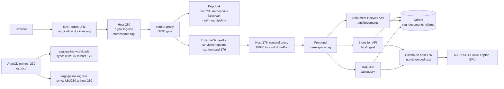

# ragpipeline

Phase 1 RAG stack for the homelab.

## Target Layout

- Workload cluster: `192.168.1.176`, namespace `rag`
- Ingress/auth cluster: `192.168.1.230`, namespace `rag`
- Public URL: `https://ragpipeline.duckdns.org`
- Keycloak: `https://goodmanreunion.duckdns.org/keycloak/realms/ragpipeline`
- Vector database: Qdrant
- Generation provider: Ollama on host `176`
- Embeddings provider: Ollama `nomic-embed-text`
- Ollama: host systemd service on `176`, bound to `0.0.0.0:11434`; the in-cluster Ollama Deployment is kept offline with `replicas: 0`

## What Phase 1 Deploys

- Qdrant
- ingestion API at `/api/ingest`
- website ingestion API at `/api/ingest/url`
- document lifecycle API at `/api/documents`
- RAG API at `/api/query`
- static frontend
- Secrets/ConfigMaps
- NodePort exposure on host `176`
- nginx Ingress on host `230`
- Keycloak OIDC protection through `oauth2-proxy`

## Request Flow



## LLM Provider Notes

The active Phase 1 config uses the host `176` Ollama service:

- Chat model: `qwen2.5:1.5b`
- Embedding model: `nomic-embed-text`
- Qdrant collection: `rag_documents_ollama`
- Vector size: `768`

Host `176` has an NVIDIA RTX 3070 Laptop GPU with 8 GiB VRAM. Ollama detects it
through CUDA, so small models are a reasonable fit. Larger 7B-class models may
fit only with heavy quantization and will be tight because system RAM is already
under pressure.

The Kubernetes Ollama Deployment remains defined but scaled to zero. Kind GPU
device scheduling is not active yet: the NVIDIA device plugin runs, but the Kind
nodes do not advertise `nvidia.com/gpu` until the NVIDIA container runtime/toolkit
is wired into the Kind node containerd runtime.

## OpenAI Billing Reality Check

Your paid Codex/ChatGPT subscription does not automatically pay for API usage.
OpenAI documents ChatGPT billing and API Platform billing as separate systems, and
ChatGPT Plus says API usage is separate and billed independently. OpenAI is no
longer required for the default deployment, but if you switch back to OpenAI you
need an API Platform organization with billing enabled and an `OPENAI_API_KEY`.

Check:

1. Sign in at `https://platform.openai.com`.
2. Open `https://platform.openai.com/account/billing/overview`.
3. Confirm the organization has Pay-As-You-Go or another API billing plan.
4. Create a project API key and put it into the Kubernetes secret below.

Sources:

- https://help.openai.com/en/articles/9039756-billing-settings-in-chatgpt-vs-platform
- https://help.openai.com/en/articles/6950777-what-is-chatgpt-plus
- https://platform.openai.com/docs/pricing/

## Required Secrets

Create these before deploying workloads if you plan to use OpenAI or Anthropic.
The default Ollama deployment does not require an API key, but the existing API
Deployments still tolerate this secret being present.

```bash
kubectl create namespace rag --dry-run=client -o yaml | kubectl apply -f -

kubectl -n rag create secret generic rag-llm-secrets \
  --from-literal=OPENAI_API_KEY='sk-...' \
  --from-literal=ANTHROPIC_API_KEY=''
```

Create this on host `230` after creating a Keycloak client:

```bash
~/.local/bin/kubectl create namespace rag --dry-run=client -o yaml | ~/.local/bin/kubectl apply -f -

~/.local/bin/kubectl -n rag create secret generic rag-oauth2-proxy-secrets \
  --from-literal=OAUTH2_PROXY_CLIENT_ID='ragpipeline' \
  --from-literal=OAUTH2_PROXY_CLIENT_SECRET='paste-client-secret-here' \
  --from-literal=OAUTH2_PROXY_COOKIE_SECRET='paste-32-byte-base64-secret-here'
```

Generate a cookie secret:

```bash
openssl rand -base64 32
```

## Keycloak Client

Create a client in realm `ragpipeline`:

- Client ID: `ragpipeline`
- Client type: OpenID Connect
- Access type: confidential
- Valid redirect URI: `https://ragpipeline.duckdns.org/oauth2/callback`
- Web origin: `https://ragpipeline.duckdns.org`

## Build And Deploy

From this repo on your workstation:

```bash
./scripts/sync-to-176.sh
```

On host `176`:

```bash
cd /home/ron-goodman/Projects/ragpipeline
./scripts/build-images.sh
./scripts/deploy-176.sh
```

On host `230`:

```bash
cd /home/rongoodman/Projects/ragpipeline
./scripts/deploy-230.sh
```

## Ship To Production

Production changes should land on `main`. Use the helper script to run local
sanity checks, commit, and push:

```bash
./scripts/ship-prod.sh "Describe the production change"
```

Pushing to `main` starts the GitHub Actions production image workflow. The
workflow builds the API and frontend images, pushes them to GitHub Container
Registry, updates the `k8s/176` manifests with commit-specific image tags, and
pushes that manifest update back to `main`. ArgoCD watches `main` and then syncs
the changed workload manifests to the production cluster.

If the GHCR packages are private, create an image pull secret in the `rag`
namespace or make the packages public so the cluster can pull them.

## Document Lifecycle And Website Ingestion

Uploaded files and ingested URLs are stored in Qdrant with document-level
metadata so they can be listed, replaced, and deleted as a unit. Re-ingesting the
same filename or URL replaces the existing chunks for that document.

Each chunk payload includes:

- `document_id`
- `source_type`
- `source_uri`
- `title`
- `filename`
- `content_hash`
- `version_id`
- `ingested_at`
- `updated_at`
- `chunk_index`
- `chunk_count`
- `license`
- `attribution`

The API exposes:

- `POST /api/ingest` for `.txt`, `.md`, and `.pdf` uploads.
- `POST /api/ingest/url` with JSON body `{"url": "https://example.com/page"}`.
- `POST /api/ingest/docs/python` with JSON body
  `{"url": "https://docs.python.org/3/"}` to ingest the official Python HTML
  docs archive as a background job.
- `GET /api/ingest/jobs/{job_id}` to check docs archive ingestion progress.
- `GET /api/documents` to list indexed documents.
- `DELETE /api/documents/{document_id}` to delete all chunks for one document.
- `DELETE /api/collections/{collection_id}` to delete a bundled docs ingest.
- `POST /api/query` to query the indexed chunks.

URL ingestion only accepts `http` and `https`, verifies `robots.txt` before
fetching the page, sends the `INGEST_USER_AGENT`, and limits fetched content to
`MAX_URL_BYTES` bytes. Private, loopback, link-local, reserved, and multicast
targets are blocked unless `ALLOW_PRIVATE_URL_INGEST=true` is set. It currently
ingests one page at a time; sitemap crawling is intentionally left for a later
step so rate limiting, scope rules, and attribution can be handled deliberately.

Python docs ingestion uses the official `docs.python.org` HTML zip archive from
the Python documentation download page instead of crawling links. Each HTML page
inside the archive is indexed as a separate document with `source_type` set to
`docs_page`, and the whole bundle gets a `collection_id` such as
`python-docs-3`. Re-ingesting the same docs URL with `replace: true` deletes the
old bundle first, then indexes the current official archive.

## ArgoCD

ArgoCD runs on host `230` and syncs the RAG workloads to host `176`.
The ArgoCD setup is split into two Applications because one Application can only
sync to one destination:

- `ragpipeline-workloads`: syncs `k8s/176` to host `176`, namespace `rag`
- `ragpipeline-ingress`: syncs `k8s/230` to host `230`, namespace `rag`
- `reunion`: syncs the Goodman Reunion `k8s` path to host `230`, namespace `reunion`

The manifests assume the public Git repo will be:

```text
https://github.com/rawhideron/ragpipeline
```

After pushing this repo there, create/update the ArgoCD apps from host `230`:

```bash
cd /home/rongoodman/Projects/ragpipeline
./scripts/deploy-argocd.sh
```

## Verify

```bash
curl -k https://ragpipeline.duckdns.org/health
```

In the browser:

1. Open `https://ragpipeline.duckdns.org`.
2. Log in through Keycloak.
3. Upload a `.txt`, `.md`, or `.pdf` document.
4. Ingest a single documentation URL if desired.
5. Use the document list to confirm or delete indexed documents.
6. Ask a question about the ingested content.
